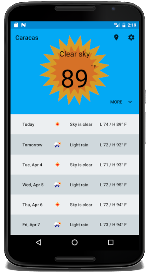
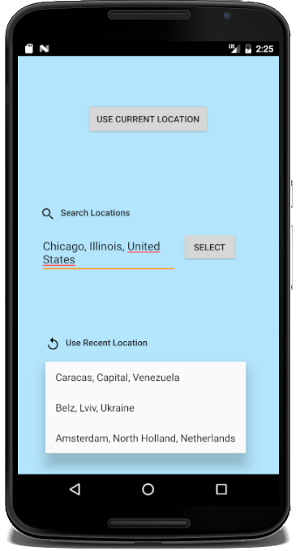

# Android Weather App

This simple weather application provides current weather data and forecasts for locations around the globe.

## Features
- Weather and forecast display
- Set location to device location
- Location search autocomplete
- Select location from 10 most recently used
- Change frequency of background data updates
- Select imperial or metric units

## Screenshots

## Tools

This project offered an opportunity to explore a variety of techniques and become aquainted with several popular libraries. I used:

Android:
- ConstraintLayout
- RecyclerView
- Android Data Binding

Libraries:
- JUnit 4
- ButterKnife
- Dagger 2
- Retrofit 2
- RxJava
- android-job
- Glide

